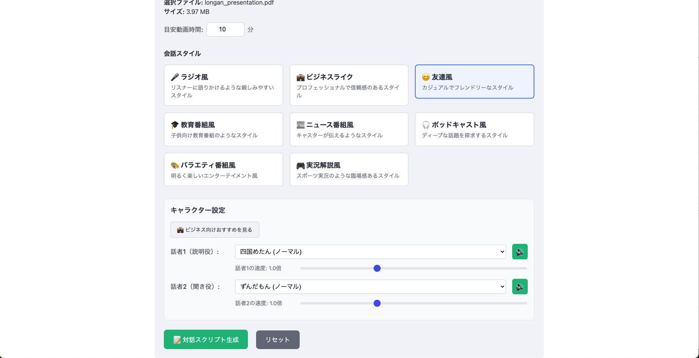
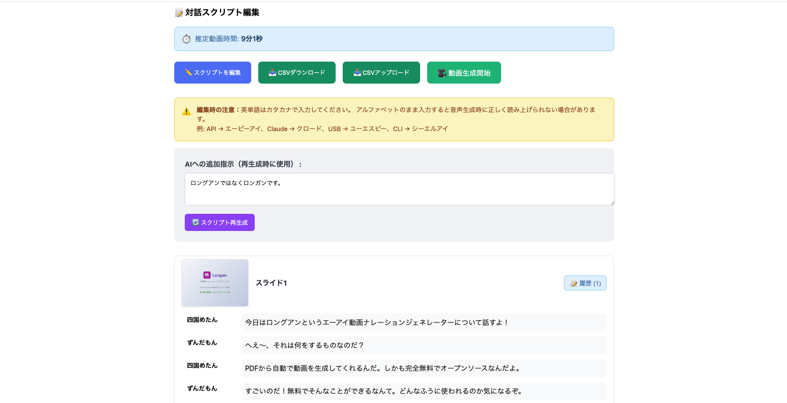

# Longan（ロンガン） - AI動画ナレーションジェネレーター

[](https://github.com/Tdual/longan)
[](https://opensource.org/licenses/MIT)
[](https://github.com/Tdual/longan/blob/main/README.md)
[](https://www.python.org/)
[](https://www.docker.com/)
[](https://voicevox.hiroshiba.jp/)

**🌐 公式サイト: https://longan-ai.com/**

**🎉 完全無料のオープンソースソフトウェア（OSS）です！**

PDFスライドを日本語音声付きの動画に変換するツールです。VOICEVOXを使用して、選択可能なキャラクターによる対話形式のナレーションを生成できます。

## 🆓 無料で使える理由

- ✅ **ソースコード公開** - GitHubで全てのコードを公開
- ✅ **商用利用可能** - 個人・法人問わず無料で利用可能
- ✅ **改変・再配布自由** - MITライセンスで自由に改変・配布できます
- ✅ **音声合成も無料** - VOICEVOXは無料で使える日本語音声合成エンジン
- ✅ **隠れたコストなし** - サブスクリプションや追加料金は一切不要

※ AIによる対話生成機能を使用する場合のみ、各AIプロバイダーのAPIキーが必要です（OpenAI、Claude等）
※ LLM（大規模言語モデル）の使用料金は、各プロバイダーの従量課金に基づきユーザー負担となります

## 🌟 オープンソースだから実現できること

### 💰 完全無料
- サブスクリプションや追加料金は一切不要
- ソフトウェア自体は永久に無料で利用可能
- 利用制限や機能制限なし

### 🔍 完全な透明性
- ソースコードを確認し、何が行われているか把握できます
- セキュリティ監査や脆弱性チェックが可能
- 不正なデータ収集やバックドアの心配なし

### 🔒 データの完全管理
- 機密情報がクラウドに送信されることなく、自社サーバーで処理
- 社内ポリシーに完全準拠した運用が可能
- GDPRやその他のプライバシー規制に対応

### 🛠️ カスタマイズ自由
- 自社の要件に合わせて機能追加・改変が可能
- 独自のワークフローやビジネスロジックの実装
- 既存システムとのシームレスな統合

## 🎬 PDFから動画へ変換

### 📄 入力：PDFスライド


**↓ Longanで変換 ↓**

### 🎥 出力：ナレーション付き動画
- 🎙️ VOICEVOXキャラクターによる対話形式のナレーション
- 📽️ スライドと音声が同期した動画ファイル（MP4）
- ⏱️ 指定した目標時間に自動調整

### 🎬 デモ動画

[](https://youtu.be/hmOCkK2v5nM)

*クリックしてYouTubeでデモ動画を視聴*

## ⚙️ キャラクター・会話形式の設定

VOICEVOXの18種類のキャラクターから選択でき、会話スタイルも自由にカスタマイズできます。



### 設定可能な項目
- 🎭 **キャラクター選択**: 四国めたん、ずんだもん、春日部つむぎなど18種類から選択
- 💬 **会話スタイル**: 友達風、ビジネスライク、ラジオ風、解説風など
- ⏱️ **目標時間**: 動画の長さを分単位で指定

## ✏️ 対話スクリプトの編集

生成された対話内容は、WebアプリでAIに再生成を指示したり、手動で直接編集することができます。



### 編集機能
- 🤖 **AI再生成**: スライドごとに対話内容をAIに再生成させる
- ✍️ **手動編集**: テキストエリアで直接対話内容を修正
- 🎭 **スピーカー変更**: 発言者（四国めたん/ずんだもん）を切り替え
- 🔄 **リアルタイム反映**: 編集内容が即座に動画生成に反映

## ユースケース

### 🏢 コーポレート／サービス紹介動画
自社のビジネスモデルや新製品の魅力を、ナレーション付きの短い映像でわかりやすく伝えます。営業資料やウェブサイトへの組み込みで、訴求力がアップします。

### 📱 プロモーション＆キャンペーン動画
商品ローンチやセール情報を、TikTokやYouTube Shorts向けのショート動画として自動生成。縦型フォーマットにも対応し、SNSでの拡散を後押しします。

### 📊 財務レポート／マーケット分析の動画化
決算説明資料や市場調査レポートを、視覚的に訴えるアニメーション動画に変換。専門知識がない人にも要点が伝わりやすくなります。

### 🎓 社内研修・オンボーディング教材
マニュアルや研修スライドをベースにした解説動画を生成。新入社員向けやリモート研修での理解促進に役立ちます。

### 💻 技術勉強会のプレゼン動画
セミナー用スライドやハンドアウトの骨子を取りまとめ、ポイント解説付きの動画に。参加者への事前配布資料や復習コンテンツとして活用できます。

### 🔧 OSSハンズオンチュートリアル
オープンソースライブラリやツールのインストール手順から基本操作までを、実演イメージの動画でガイド。ドキュメントだけでは難しい操作感をサポートします。

### 📰 雑学・ニュースダイジェスト動画
気になるトピックや最新ニュースをサクッと解説。短い尺で要点をまとめたコンテンツを自動生成し、視聴者の興味を引きつけます。

## 特徴

- 📄 PDFページをスライド画像に変換
- 🎙️ VOICEVOXを使用した高品質な日本語音声合成（18種類のキャラクター）
- 💬 複数のAIプロバイダーによる自然な対話形式のナレーション自動生成
  - OpenAI (GPT-4, GPT-3.5)
  - Claude (Anthropic)
  - Google Gemini
  - AWS Bedrock
- 🎬 スライドと音声を同期した動画生成
- ✏️ Webアプリで対話内容を編集・再生成可能
- ⚙️ Web UIでのLLMプロバイダー設定とAPIキー管理

## インストール

### 1. リポジトリのクローン
```bash
git clone https://github.com/Tdual/longan.git
cd longan
```

### 2. 起動（推奨：起動スクリプトを使用）
```bash
# 起動スクリプトを使用（.envファイルが自動的に作成されます）
./start.sh

# バックグラウンドで起動する場合
./start.sh -d
```

起動スクリプトは以下を自動的に行います：
- `.env`ファイルが存在しない場合、`.env.example`をコピーして作成
- Docker Composeでサービスを起動

### 3. 手動での起動（代替方法）
```bash
# .envファイルを手動で作成
cp .env.example .env

# Docker Composeで起動
docker-compose up -d
```

### Docker Compose設定の詳細

`docker-compose.yml`では以下の3つのサービスを定義しています：

#### 1. **voicevox** サービス（音声合成エンジン）
```yaml
voicevox:
  image: voicevox/voicevox_engine:cpu-ubuntu20.04-latest
  ports:
    - "50021:50021"
```
- **役割**: 日本語テキストを音声に変換する音声合成エンジン
- **イメージ**: VOICEVOXの公式DockerイメージのCPU版を使用
- **ポート**: 50021番ポートでAPIを提供
- **特徴**: GPU不要で動作し、18種類のキャラクターボイスが利用可能

#### 2. **api** サービス（バックエンドAPI）
```yaml
api:
  build:
    context: .
    dockerfile: Dockerfile.api
  ports:
    - "8002:8000"
  volumes:
    - ./uploads:/app/uploads
    - ./slides:/app/slides
    - ./audio:/app/audio
    - ./output:/app/output
    - ./data:/app/data
  environment:
    - VOICEVOX_URL=http://voicevox:50021
  depends_on:
    - voicevox
```
- **役割**: PDFの処理、対話生成、音声生成、動画作成を行うAPIサーバー
- **ポート**: ホストの8002番ポートをコンテナの8000番にマッピング
- **ボリューム**: 
  - `uploads`: アップロードされたPDFファイル
  - `slides`: PDFから変換されたスライド画像
  - `audio`: 生成された音声ファイル
  - `output`: 最終的な動画ファイル
  - `data`: 対話スクリプトのJSONファイル
- **環境変数**: VOICEVOXへの接続URLを設定（サービス間通信）
- **依存関係**: voicevoxサービスが起動してから起動

#### 3. **frontend** サービス（Webアプリ）
```yaml
frontend:
  build:
    context: ./frontend
    dockerfile: Dockerfile
  ports:
    - "3000:3000"
  environment:
    - PUBLIC_API_URL=http://localhost:8002
  depends_on:
    - api
```
- **役割**: ユーザーインターフェースを提供するWebアプリケーション
- **ポート**: 3000番ポートでWebアプリにアクセス
- **環境変数**: APIサーバーのURLを設定
- **依存関係**: apiサービスが起動してから起動

#### ネットワーク設定
```yaml
networks:
  default:
    name: app-network
```
- 全サービスが同一ネットワーク（app-network）に接続
- サービス間はサービス名で通信可能（例：`http://voicevox:50021`）

これで以下のサービスが起動します：
- Webアプリ: http://localhost:3000
- API: http://localhost:8002
- VOICEVOX: http://localhost:50021

### Docker Composeの基本操作

```bash
# サービスの起動（バックグラウンド実行）
docker-compose up -d

# サービスの停止
docker-compose down

# サービスの再起動（コード変更を反映）
docker-compose restart api

# ログの確認
docker-compose logs -f api      # APIのログをリアルタイム表示
docker-compose logs frontend    # フロントエンドのログ表示
docker-compose logs voicevox    # VOICEVOXのログ表示

# コンテナの状態確認
docker-compose ps

# 再ビルド（Dockerfileを変更した場合）
docker-compose build --no-cache api
docker-compose up -d

# 完全なクリーンアップ（データも削除）
docker-compose down -v
```

### 4. ローカル環境での起動（代替方法）

#### Backend (API)の起動
```bash
cd api
pip install -r requirements.txt
uvicorn main:app --reload
```

#### Frontend (Webアプリ)の起動
```bash
cd frontend
npm install
npm run dev
```

#### VOICEVOXの起動
VOICEVOXを別途ダウンロードして起動してください。

## 使用方法

### Webアプリでの使い方（推奨）

1. ブラウザで `http://localhost:3000` にアクセス
2. 初回起動時は設定画面（`http://localhost:3000/settings`）でLLMプロバイダーのAPIキーを設定
3. PDFファイルをアップロード
4. 以下の設定を行う：
   - 目安時間（分）
   - スピーカー1（デフォルト：四国めたん）
   - スピーカー2（デフォルト：ずんだもん）
   - 会話スタイル（友達風、ビジネス風など）
5. 「動画を生成」ボタンをクリック
6. 生成された対話を確認・編集
7. 動画をダウンロード

### スクリプトでの使い方（上級者向け）

1. PDFファイルを`uploads/`ディレクトリに配置
2. VOICEVOXを起動（デフォルト: http://localhost:50021）
3. 対話と音声を生成：
   ```bash
   python scripts/generate_audio.py
   ```
4. 動画を生成：
   ```bash
   python scripts/create_video.py
   ```

## 必要な環境

- Python 3.8+
- VOICEVOX（音声合成エンジン）
- OpenAI APIキー（対話生成用）
- Node.js 18+（Webアプリ用）

### 推奨：Docker環境での実行

Dockerを使用すれば、VOICEVOXやNode.jsの環境構築が不要になります。
詳細は[README_DOCKER.md](README_DOCKER.md)を参照してください。

## プロジェクト構成

```
longan/
├── api/                    # FastAPI Backend
│   ├── core/              # コア機能
│   │   ├── dialogue_generator.py    # GPT-4による対話生成
│   │   ├── dialogue_refiner.py      # 対話内容の調整
│   │   ├── audio_generator.py       # VOICEVOX音声生成
│   │   ├── video_creator.py         # 動画作成
│   │   └── pdf_processor.py         # PDF処理
│   └── main.py            # APIエンドポイント
├── frontend/              # SvelteKit Frontend
│   ├── src/              
│   │   └── routes/       # Webアプリ画面
│   └── package.json      
├── src/                   # 共通ライブラリ
│   ├── dialogue_video_creator.py    # 高品質動画作成
│   └── voicevox_generator.py        # VOICEVOX制御
├── docker-compose.yml     # Docker設定
├── uploads/              # アップロードされたPDF
├── output/               # 生成された動画
├── slides/               # 抽出されたスライド画像
└── audio/                # 生成された音声ファイル
```

## API仕様

### 主要エンドポイント

#### ジョブ管理
- **POST /api/jobs/upload** - PDFアップロードとジョブ作成
  - Parameters: file, target_duration, speaker1_id, speaker2_id, conversation_style
- **GET /api/jobs/{job_id}/status** - ジョブ進行状況確認
- **GET /api/jobs** - 全ジョブリスト取得
- **DELETE /api/jobs/{job_id}** - ジョブ削除

#### 対話・動画生成
- **POST /api/jobs/{job_id}/generate-dialogue** - 対話スクリプト生成
- **PUT /api/jobs/{job_id}/dialogue** - 対話スクリプト編集
- **POST /api/jobs/{job_id}/generate-video** - ワンクリック動画生成
- **GET /api/jobs/{job_id}/download** - 完成動画ダウンロード

#### 音声・スピーカー
- **GET /api/speakers** - VOICEVOX話者一覧取得
- **POST /api/voice-sample** - 音声サンプル生成

#### データ管理
- **GET /api/jobs/{job_id}/dialogue** - 対話スクリプト取得
- **GET /api/jobs/{job_id}/dialogue/csv** - CSV形式でダウンロード
- **POST /api/jobs/{job_id}/dialogue/csv** - CSVからインポート
- **GET /api/jobs/{job_id}/slides** - スライド画像リスト
- **GET /api/jobs/{job_id}/metadata** - ジョブメタデータ

#### LLM設定
- **GET /api/settings/providers** - LLMプロバイダー一覧と状態
- **POST /api/settings/provider** - プロバイダー設定保存
- **DELETE /api/settings/provider/{provider}** - プロバイダー削除
- **POST /api/settings/test-key** - APIキー有効性テスト
- **PUT /api/settings** - 全般設定更新

### スクリプト機能

#### 音声生成スクリプト
```bash
# 表現豊かな音声生成（抑揚1.2、フェードアウト付き）
python scripts/generate_audio.py

# カタカナ変換音声生成
python scripts/generate_katakana_audio.py

# シンプル音声生成
python scripts/generate_katakana_audio_simple.py
```

#### 動画作成スクリプト
```bash
# 高品質動画作成（フェードアウト処理、最適化された間隔）
python scripts/create_video.py

# 改良版動画作成
python scripts/create_improved_video.py

# テスト動画作成
python scripts/create_katakana_test_video.py
```

#### ユーティリティスクリプト
```bash
# ファイル整理
python scripts/organize_files.py
```

### VOICEVOX話者ID
- 2: 四国めたん（ノーマル）
- 3: ずんだもん（ノーマル）
- 8: 春日部つむぎ（ノーマル）
- 10: 波音リツ（ノーマル）
- 13: 青山龍星（ノーマル）
- 16: 九州そら（ノーマル）
- 20: もち子さん（ノーマル）

## 主な機能

### 対話生成機能
- GPT-4を使用した自然な対話生成
- スライドの重要度を自動判定し、時間配分を最適化
- スライド間の文脈を保持した一貫性のある対話


### 音声品質
- 抑揚を1.2に設定して表現豊かな音声を実現
- 各音声の終わりに50msのフェードアウトを適用
- 話者間の間隔を0.8秒に最適化
- キャラクターごとの話速調整

## トラブルシューティング

### NumPy互換性エラー
```
A module that was compiled using NumPy 1.x cannot be run in NumPy 2.0.2
```
**解決策**: NumPy 1.xにダウングレード
```bash
pip install "numpy<2"
```

### 動画が開けない（moov atom not found）
**原因**: NumPy 2.xとの互換性問題
**解決策**: NumPy 1.xを使用し、成功したコードを再実行

### VOICEVOX接続エラー
**確認事項**:
1. VOICEVOXが起動していること
2. ポート50021でアクセス可能なこと
3. ファイアウォールでブロックされていないこと

## 出力

- 生成された動画ファイル（output/ディレクトリ）
- スライド画像（slides/ディレクトリ）
- 音声ファイル（audio/ディレクトリ）

## ライセンス

このプロジェクトはMITライセンスの下で公開されています。

### VOICEVOX音声利用時の注意事項

生成された音声を使用する際は、以下の規約を遵守してください：

- **クレジット表記が必要です**
  - 動画や作品で音声を使用する場合、必ず「VOICEVOX:キャラクター名」の表記を行ってください
  - 例：「VOICEVOX:ずんだもん」「VOICEVOX:四国めたん」

- **各キャラクターの利用規約を遵守してください**
  - キャラクターごとに個別の利用規約があります
  - 公序良俗に反する利用は禁止されています
  - 詳細は各キャラクターの公式ページをご確認ください

## 謝辞

- VOICEVOX: 高品質な日本語音声合成エンジン
- 全てのOSSコミッター: このプロジェクトを支えるオープンソースライブラリの開発と維持に感謝

## 開発メンバー

- プロダクトマネージャー：tdual(ティーデュアル)
- 開発者：Claude Code

## 連絡先

- Email: tdualdir@gmail.com
- X (Twitter): https://x.com/tdualdir