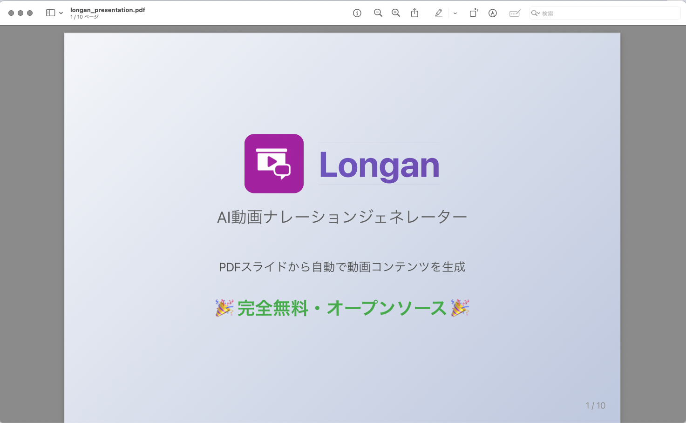

# Longan - AI動画ナレーションジェネレーター

**🎉 完全無料のオープンソースソフトウェア（OSS）です！**

PDFスライドを日本語音声付きの動画に変換するツールです。VOICEVOXを使用して、選択可能なキャラクターによる対話形式のナレーションを生成できます。

## 🆓 無料で使える理由

- ✅ **ソースコード公開** - GitHubで全てのコードを公開
- ✅ **商用利用可能** - 個人・法人問わず無料で利用可能
- ✅ **改変・再配布自由** - MITライセンスで自由に改変・配布できます
- ✅ **音声合成も無料** - VOICEVOXは無料で使える日本語音声合成エンジン
- ✅ **隠れたコストなし** - サブスクリプションや追加料金は一切不要

※ AIによる対話生成機能を使用する場合のみ、各AIプロバイダーのAPIキーが必要です（OpenAI、Claude等）
※ LLM（大規模言語モデル）の使用料金は、各プロバイダーの従量課金に基づきユーザー負担となります

## 🎬 PDFから動画へ変換

### 📄 入力：PDFスライド


**↓ Longanで変換 ↓**

### 🎥 出力：ナレーション付き動画
- 🎙️ VOICEVOXキャラクターによる対話形式のナレーション
- 📽️ スライドと音声が同期した動画ファイル（MP4）
- ⏱️ 指定した目標時間に自動調整

*※ 動画サンプルは準備中です*

## ユースケース

### 🏢 コーポレート／サービス紹介動画
自社のビジネスモデルや新製品の魅力を、ナレーション付きの短い映像でわかりやすく伝えます。営業資料やウェブサイトへの組み込みで、訴求力がアップします。

### 📱 プロモーション＆キャンペーン動画
商品ローンチやセール情報を、TikTokやYouTube Shorts向けのショート動画として自動生成。縦型フォーマットにも対応し、SNSでの拡散を後押しします。

### 📊 財務レポート／マーケット分析の動画化
決算説明資料や市場調査レポートを、視覚的に訴えるアニメーション動画に変換。専門知識がない人にも要点が伝わりやすくなります。

### 🎓 社内研修・オンボーディング教材
マニュアルや研修スライドをベースにした解説動画を生成。新入社員向けやリモート研修での理解促進に役立ちます。

### 💻 技術勉強会のプレゼン動画
セミナー用スライドやハンドアウトの骨子を取りまとめ、ポイント解説付きの動画に。参加者への事前配布資料や復習コンテンツとして活用できます。

### 🔧 OSSハンズオンチュートリアル
オープンソースライブラリやツールのインストール手順から基本操作までを、実演イメージの動画でガイド。ドキュメントだけでは難しい操作感をサポートします。

### 📰 雑学・ニュースダイジェスト動画
気になるトピックや最新ニュースをサクッと解説。短い尺で要点をまとめたコンテンツを自動生成し、視聴者の興味を引きつけます。

## 特徴

- 📄 PDFページをスライド画像に変換
- 🎙️ VOICEVOXを使用した高品質な日本語音声合成（18種類のキャラクター）
- 💬 複数のAIプロバイダーによる自然な対話形式のナレーション自動生成
  - OpenAI (GPT-4, GPT-3.5)
  - Claude (Anthropic)
  - Google Gemini
  - AWS Bedrock
- 🎬 スライドと音声を同期した動画生成
- ✏️ Webアプリで対話内容を編集・再生成可能
- ⚙️ Web UIでのLLMプロバイダー設定とAPIキー管理

## 必要な環境

- Python 3.8+
- VOICEVOX（音声合成エンジン）
- OpenAI APIキー（対話生成用）
- Node.js 18+（Webアプリ用）

### 推奨：Docker環境での実行

Dockerを使用すれば、VOICEVOXやNode.jsの環境構築が不要になります。
詳細は[README_DOCKER.md](README_DOCKER.md)を参照してください。

## インストール

### 1. リポジトリのクローン
```bash
git clone https://github.com/Tdual/longan.git
cd longan
```

### 2. 起動（推奨：起動スクリプトを使用）
```bash
# 起動スクリプトを使用（.envファイルが自動的に作成されます）
./start.sh

# バックグラウンドで起動する場合
./start.sh -d
```

起動スクリプトは以下を自動的に行います：
- `.env`ファイルが存在しない場合、`.env.example`をコピーして作成
- Docker Composeでサービスを起動

### 3. 手動での起動（代替方法）
```bash
# .envファイルを手動で作成
cp .env.example .env

# Docker Composeで起動
docker-compose up -d
```
これで以下のサービスが起動します：
- Webアプリ: http://localhost:3000
- API: http://localhost:8000
- VOICEVOX: http://localhost:50021

### 4. ローカル環境での起動（代替方法）

#### Backend (API)の起動
```bash
cd api
pip install -r requirements.txt
uvicorn main:app --reload
```

#### Frontend (Webアプリ)の起動
```bash
cd frontend
npm install
npm run dev
```

#### VOICEVOXの起動
VOICEVOXを別途ダウンロードして起動してください。

## 使用方法

### Webアプリでの使い方（推奨）

1. ブラウザで `http://localhost:3000` にアクセス
2. 初回起動時は設定画面（`http://localhost:3000/settings`）でLLMプロバイダーのAPIキーを設定
3. PDFファイルをアップロード
4. 以下の設定を行う：
   - 目安時間（分）
   - スピーカー1（デフォルト：四国めたん）
   - スピーカー2（デフォルト：ずんだもん）
   - 会話スタイル（友達風、ビジネス風など）
5. 「動画を生成」ボタンをクリック
6. 生成された対話を確認・編集
7. 動画をダウンロード

### スクリプトでの使い方（上級者向け）

1. PDFファイルを`uploads/`ディレクトリに配置
2. VOICEVOXを起動（デフォルト: http://localhost:50021）
3. 対話と音声を生成：
   ```bash
   python scripts/generate_audio.py
   ```
4. 動画を生成：
   ```bash
   python scripts/create_video.py
   ```

## プロジェクト構成

```
longan/
├── api/                    # FastAPI Backend
│   ├── core/              # コア機能
│   │   ├── dialogue_generator.py    # GPT-4による対話生成
│   │   ├── dialogue_refiner.py      # 対話内容の調整
│   │   ├── audio_generator.py       # VOICEVOX音声生成
│   │   ├── video_creator.py         # 動画作成
│   │   └── pdf_processor.py         # PDF処理
│   └── main.py            # APIエンドポイント
├── frontend/              # SvelteKit Frontend
│   ├── src/              
│   │   └── routes/       # Webアプリ画面
│   └── package.json      
├── src/                   # 共通ライブラリ
│   ├── dialogue_video_creator.py    # 高品質動画作成
│   └── voicevox_generator.py        # VOICEVOX制御
├── docker-compose.yml     # Docker設定
├── uploads/              # アップロードされたPDF
├── output/               # 生成された動画
├── slides/               # 抽出されたスライド画像
└── audio/                # 生成された音声ファイル
```

## API仕様

### エンドポイント

#### POST /api/jobs/upload
PDFをアップロードしてジョブを作成
- Parameters:
  - file: PDFファイル
  - target_duration: 目安時間（分）
  - speaker1_id, speaker2_id: VOICEVOX話者ID
  - conversation_style: 会話スタイル

#### GET /api/jobs/{job_id}/status
ジョブの進行状況を確認

#### POST /api/jobs/{job_id}/regenerate-dialogue
特定のスライドの対話を再生成

#### POST /api/jobs/{job_id}/create-video
最終動画を生成

### VOICEVOX話者ID
- 2: 四国めたん（ノーマル）
- 3: ずんだもん（ノーマル）
- 8: 春日部つむぎ（ノーマル）
- 10: 波音リツ（ノーマル）
- 13: 青山龍星（ノーマル）
- 16: 九州そら（ノーマル）
- 20: もち子さん（ノーマル）

## 主な機能

### 対話生成機能
- GPT-4を使用した自然な対話生成
- スライドの重要度を自動判定し、時間配分を最適化
- スライド間の文脈を保持した一貫性のある対話


### 音声品質
- 抑揚を1.2に設定して表現豊かな音声を実現
- 各音声の終わりに50msのフェードアウトを適用
- 話者間の間隔を0.8秒に最適化
- キャラクターごとの話速調整

## トラブルシューティング

### NumPy互換性エラー
```
A module that was compiled using NumPy 1.x cannot be run in NumPy 2.0.2
```
**解決策**: NumPy 1.xにダウングレード
```bash
pip install "numpy<2"
```

### 動画が開けない（moov atom not found）
**原因**: NumPy 2.xとの互換性問題
**解決策**: NumPy 1.xを使用し、成功したコードを再実行

### VOICEVOX接続エラー
**確認事項**:
1. VOICEVOXが起動していること
2. ポート50021でアクセス可能なこと
3. ファイアウォールでブロックされていないこと

## 出力

- 生成された動画ファイル（output/ディレクトリ）
- スライド画像（slides/ディレクトリ）
- 音声ファイル（audio/ディレクトリ）

## ライセンス

このプロジェクトはMITライセンスの下で公開されています。

## 謝辞

- VOICEVOX: 高品質な日本語音声合成エンジン
- 全てのOSSコミッター: このプロジェクトを支えるオープンソースライブラリの開発と維持に感謝

## 開発メンバー

- プロダクトマネージャー：tdual(ティーデュアル)
- 開発者：Claude Code

## 連絡先

- Email: tdualdir@gmail.com
- X (Twitter): https://x.com/tdualdir